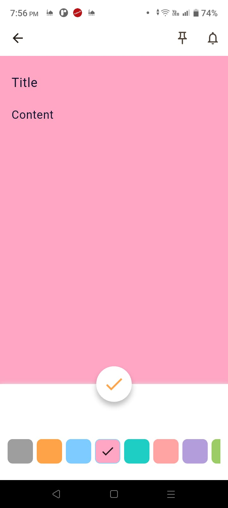
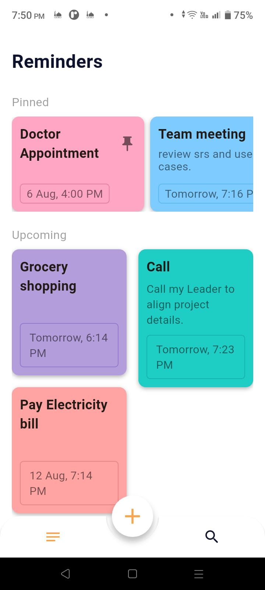
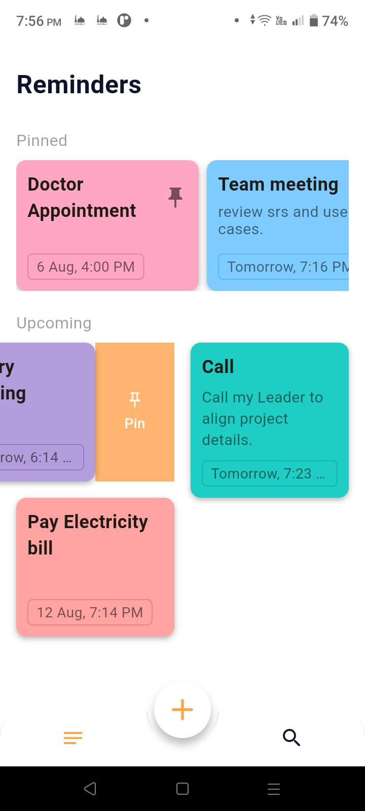
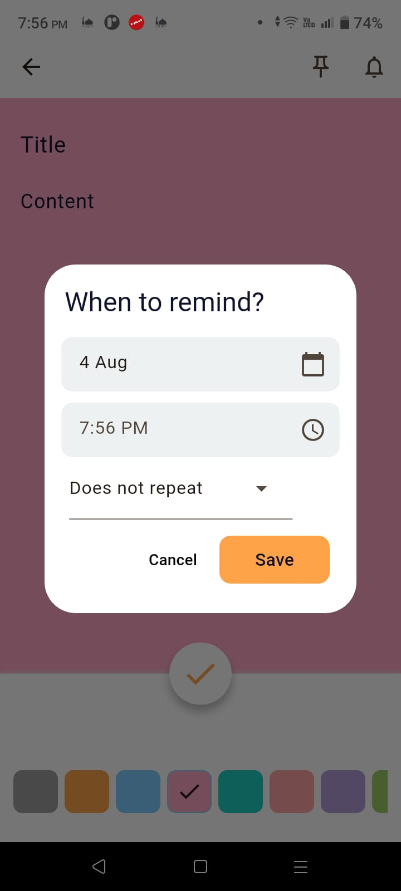
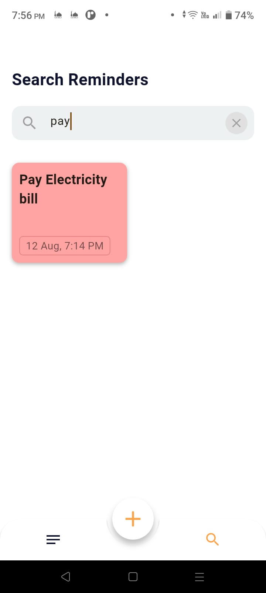
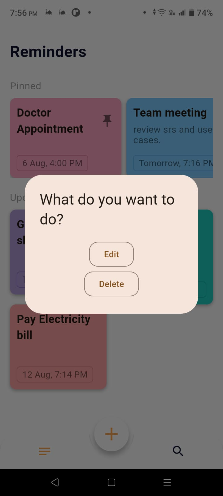
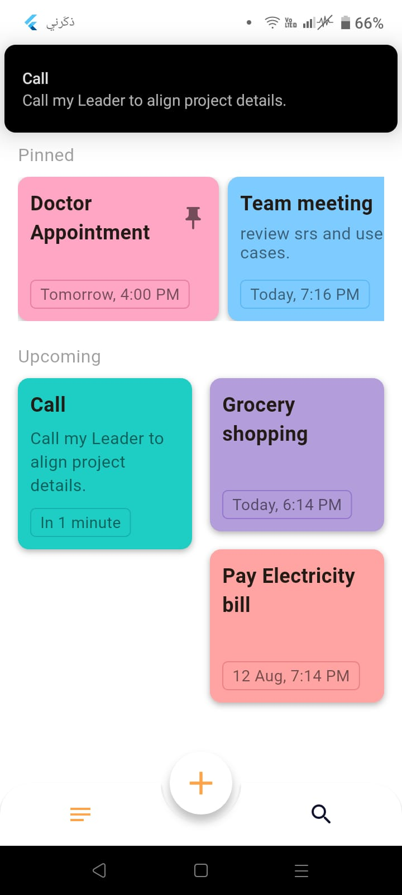
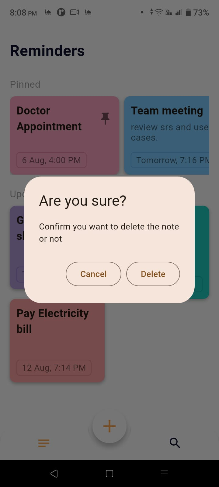
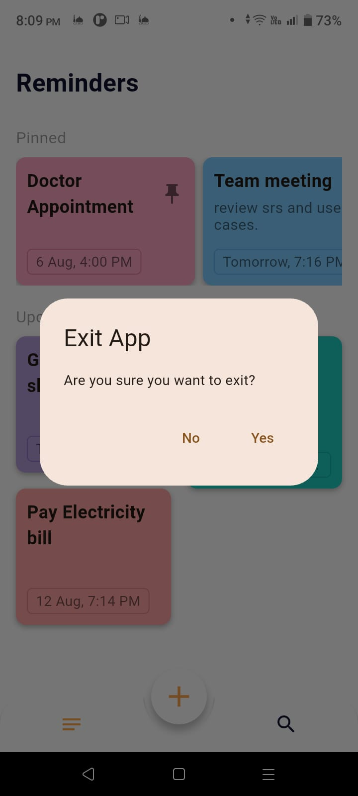

<p align="center">
  
</p>

# Remind Me -"ذكّرني" Flutter Application

## Project Overview

**Remind Me** is a Flutter application that helps users organize their daily tasks and reminders in a simple and intuitive way.

Users can create colorful note-style reminders, schedule local notifications, pin important notes, search reminders instantly, and customize each reminder with different background colors. The application focuses on productivity while providing a clean, responsive, and user-friendly experience.

The project follows **MVVM Architecture**, uses **Hive** for local data persistence, and **Flutter Local Notifications** for scheduling reminder notifications.

---

# State Management

The application uses **BLoC / Cubit** for state management.

The Cubits are responsible for:

* Adding reminders.
* Editing reminders.
* Deleting reminders.
* Pinning and unpinning reminders.
* Scheduling notifications.
* Canceling notifications.
* Searching reminders.
* Loading reminders from local storage.
* Managing application states.

---

# Local Storage

The application stores reminders locally using **Hive**.

Each reminder contains:

* Title
* Content
* Reminder Date
* Background Color
* Pinned Status
* Notification ID
* Repeat Option

Hive is also used to preserve reminder colors and pin status between app launches.

---

# Reminder Notifications

The application schedules reminder notifications using **Flutter Local Notifications**.

Users can:

* Schedule reminder notifications.
* Edit reminder date and time.
* Update scheduled notifications after editing.
* Delete reminders and automatically cancel their notifications.
* Receive notifications even when the application is closed.

---

# Pages & Features

### 1. Home Screen

* Displays all saved reminders.
* Pinned reminders always appear at the top.
* Dedicated **Upcoming Reminders** section sorted by reminder date.
* Beautiful **SliverMasonryGrid** layout where each note adapts its height according to its content.
* Quickly pin or unpin reminders using the pin icon.
* Empty state when no reminders are available.

---

### 2. Add Reminder

Users can create a new reminder by entering:

* Reminder Title
* Reminder Description
* Reminder Date
* Reminder Time
* Background Color

After saving:

* The reminder is stored locally using Hive.
* A local notification is automatically scheduled.

---

### 3. Edit Reminder

Users can edit:

* Title
* Description
* Reminder Date
* Reminder Time
* Background Color

The scheduled notification is updated automatically after saving.

---

### 4. Delete Reminder

Users can:

* Delete reminders.
* Automatically cancel the scheduled notification.

---

### 5. Pin / Unpin Reminder

Important reminders can be pinned.

Pinned reminders:

* Always appear at the top of the Home Screen.
* Can be pinned or unpinned instantly using the pin icon.
* Can also be pinned or unpinned from the **Upcoming Reminders** section using **Slidable Actions**.

---

### 6. Upcoming Reminders

Upcoming reminders are displayed in a dedicated section.

Features include:

* Automatically sorted by reminder date.
* Built using **SliverMasonryGrid**.
* Variable-height reminder cards depending on note content.
* Slidable actions for quickly changing the pin status.

---

### 7. Search Reminders

The application includes a dedicated Search Screen.

Users can:

* Search reminders by title or content.
* Instantly view matching reminders.
* Clear the search field to restore all reminders.

---

### 8. Reminder Colors

Each reminder can have its own background color.

The Add/Edit Reminder screen provides:

* Horizontal Color ListView.
* Color selection indicator.
* Saved color persists using Hive.

---

### 9. Responsive UI

The application provides a responsive and modern user interface.

Highlights:

* Adaptive layouts.
* Smooth scrolling.
* Responsive spacing.
* Responsive reminder cards.
* Masonry Grid layout for better content presentation.

---
### 10. Exit Confirmation Dialog

To prevent accidental app exits, the application displays a confirmation dialog when the user attempts to leave the Home Screen using the system back button.

Users can:

- Confirm exiting the application.
- Cancel the action and remain on the Home Screen.

This provides a smoother and more user-friendly experience.

----

# Project Structure

The project follows **MVVM Architecture**.

```text
lib
│
├── models
│
├── services
│
├── utils
│
├── views
│   ├── cubits
│   ├── pages
│   └── widgets
│
└── main.dart
```

---

# How to Run the App

1. Clone the repository.

```bash
git clone <repository-url>
```

2. Install dependencies.

```bash
flutter pub get
```

3. Run the application.

```bash
flutter run
```

---

# Screenshots

| Home Screen                          | Add Reminder                            |
| -------------------------------------| --------------------------------------- |
|  |  |

| Pin / Unpin Reminder                  | When to remind                       |
| --------------------------------------| -------------------------------------|
|     |  |

| Search Screen                         | Edit Reminder                        |
| ------------------------------------- | ----------------------------------   |
|     |        |

| Notification                          | Delete Reminder                      |
| ------------------------------------- |-----------------------------------   |
|     |   |   
| Exit Confirmation Dialog              |                                      |
|      |                                      | 


---

# Demo Video

<p align="center">
<a href="https://drive.google.com/file/d/13CfhsPYND1r1m2Gxb5AHtI3y239Sli8i/view?usp=sharing">
    
</a>
</p>

<p align="center">
<b>▶ Click the image above to watch the demo video.</b>
</p>

---

# Packages Used

### State Management

* **flutter_bloc** – State management using BLoC/Cubit.
* **bloc** – Business Logic Component.

### Local Storage

* **hive** – Local NoSQL database.
* **hive_flutter** – Flutter integration for Hive.
* **hive_generator** – Generate Hive TypeAdapters.
* **build_runner** – Code generation.

### Notifications

* **flutter_local_notifications** – Schedule local notifications.
* **timezone** – Timezone support for accurate notification scheduling.

### UI & UX

* **animated_bottom_navigation_bar** – Animated Bottom Navigation Bar.
* **flutter_staggered_grid_view** – Sliver Masonry Grid layout.
* **flutter_slidable** – Slidable actions.
* **intl** – Date & time formatting.

---

# Performance & UX Highlights

* Hive Local Storage
* Local Scheduled Notifications
* Reminder Editing
* Notification Update
* Notification Cancellation
* Pin / Unpin Reminders
* Upcoming Reminders
* Reminder Search
* SliverMasonryGrid Layout
* Slidable Actions
* Exit Confirmation Dialog
* Custom Note Colors
* Responsive UI
* MVVM Architecture
* BLoC / Cubit State Management

---

# Technologies Used

* Flutter
* Dart
* MVVM Architecture
* BLoC / Cubit
* Hive Database
* Flutter Local Notifications
* Local Storage
* SliverMasonryGrid
* Flutter Slidable
